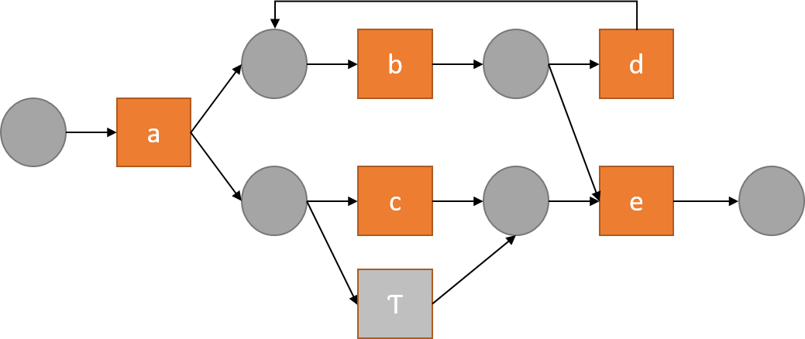
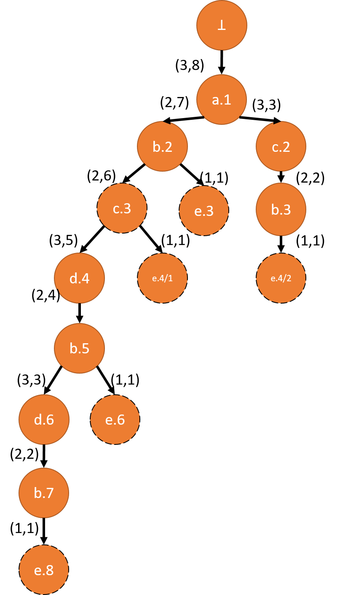

# Efficient Approximate Conformance Checking Using Trie Data Structures

## What is conformance checking?

Business process conformance checking is a sub-field of process mining. The main question conformance checking 
answers is whether the actual execution of a process as recorded in so-called execution 
event logs abides to the intended behavior defined by a process model. This goes beyond the simple binary answer to quantify the amount of 
deviation, if any. Deviation can be attributed to one of two reasons:
- Extra unfitted behavior: This is in the form of behavior observed in the log that is not allowed by the model,
- Untapped model behavior: This is the case when branches of the model behavior are not observed at all in the recorded log.

## Approaches for conformance checking

In literature, there are basically three broad approaches for conformance checking [1]: 1) Rule checking, 2) Token replay and 3) Alignments.

Currently, alignment-based approaches are considered the de-facto standard for measuring conformance. However, such approaches are expensive to compute 
as they require generating the state space of the combined model and trace behavior, a.k.a synchronous product net. The generated state space, as a graph, is further enriched with cost estimates and is fed to the A*-algorithm to find the 
shortest path from the start state, where the trace and a first activity of the model start, to an end target state
where we have executed the whole trace and also a path in the model. In between, there could be situations where we observe only an
event from the trace without a counterpart activity from the model, log move, or vice versa, model move.

The shortest path found is called an optimal alignment as it will always have the minimum number of non-synchronous moves, 
either log moves or model moves, that makes the trace matches the model behavior. The deviation, also called cost of an alignment
is the number of non-synchronous moves. Of course, an alignment of cost 0 indicates a perfect match between the trace and the model.

## Approximate approaches for computing alignments

The approach above is guaranteed to find an optimal alignment as it will exhaust the search space. However, such space might be infinite. Or it might be finite but prohibitively large to exhaustively explore.
Thus, a number of approaches have been proposed to approximate the computation of optimal alignments.

A family of these approaches depend on the explicit representation of the model behavior as a set of traces [3]. Then, Levenshtein distance, based on insertion or deletions only
is used to find the minimum distance and thus the _cheapest_ alignment between a log trace and a trace in the model behavior [2]. This approach is considered approximate because the model behavior chosen is usually a subset of the 
_whole_ behavior of the model. So, the cheapest alignment found is not guaranteed to be optimal, because there might be another model trace that was not picked that better aligns with the log trace. 

### Using tries for efficient computation of approximate alignments

As we pick a finite subset of the model behavior and reduce alignment computation to a kind of string matching problem, we can encode the model behavior, represented by a set of (traces) strings in compact way that can speed up the match.

Currently, finding the best alignment would require one-to-one comparison between the log trace and each trace in the model behavior.

In string matching, tries, a.k.a as prefix trees, can speed up the search by logarithmically reducing the search space with each matching character between the input string, the log trace in our case, and the set of predefined strings, the model behavior. Moreover, the encoding of the model behavior requires a logarithmic space to store the model behavior as all common prefixes between model traces will be stored once.

### Example

Consider the Petri net below to be our process model.

Out of this model, we can obtain the following set of model traces. Note that the  model 

1. <a,b,c,e>
2. <a,b,c,d,b,e>
3. <a,b,c,d,b,d,b,e>
4. <a,c,b,e>
5. <a,b,e>

Note that, due to the loop in the model, the sequence <b,d> can repeat arbitrarily, causing traces of possibly infinite length.

Consider also the following log traces to compute alignment for:

1. <a,b,c,e>
2. <a,e>
3. <c,e>
4. <a,c,b,d,e>
5. <a,b,e>
6. <a, c, b, d, b, d, b, d, b, e>

To compute alignments using edit distance, for each trace in the log trace (the second set of traces), we need to compare it with each of the model traces (the upper set) computing the edit distance and at the end report the trace that gives the least edit distance and actually reporting the edit operations, insertions or deletions as the alignment. For instance, log trace 3 &lt;c, e&gt; would have an edit distance of 3 with model trace 5 &lt; a,b, e&gt;, whereas it has an edit distance of 2 compared to model trace 1 &lt;a, b, c, e&gt;. Note also that log trace number 6 is actually possible by the Petri net. So, in an exhaustive approach, it would have an alignment cost of 0. However, in our case, its cheapest alignment would be with model trace 3 &lt; a,b,c,d,b,d,b,e &gt; with edit distance of 4.

The trie below is constructed from the five model traces above.

We can see that, trace `<a,b,c,e>` matches a path in the trie and total cost is 0. For trace `<a,e>`, event `a` matches the label of node `a.1`, thus, a synchronous move is made. The corresponding state is added to the queue with cost 0. Next, we try to match the first event in the suffix `<e>`, to a child of node `a.1`. As there is no match, we have to consider making log and model moves. The cost of making the log move is the length of the suffix in addition to the minimum path length from `a.1` to an end of a trace, i.e. 0+2=2. For node `a.1`, there are two model moves, i.e., executing `b` via node `b.2` or `c` via node `c.2`, the cost of making model move `b` is 1+1=2, length of suffix `<e>` plus the minimum path length from `b.2` to the end. This cost is further reduced by 1 as `b` has a child with the label `e`. Thus, the final cost for taking `b.2` is 1. The cost of making move `c` is 1+2=3. The three states `s1=[a.1, <(a,a),(>>,e)>,<>>,2]` , `s2=[b.2, <(a,a),(b,>>)> ,<e> ,1]`, and `s3=[c.2, <(a,a),(c,>>)> ,<e> ,3]` are enqueued. `s2` is the cheapest. From `s2`, a synchronous move `(e,e)` is found, and we reach the end of both the path in the trie and the trace with alignment as `<(a,a), (b,>>), (e,e)>` with alignment cost of 1. `s2` is now a candidate state. Next, `s1` will be dequeued. Here, we have traversed the whole trace, and we need to follow the shortest path in the trie. So, the alignment will be `<(a,a), (>>,e), (b,>>), (e,>>)` with cost 2. However, since this cost is greater than the cost of the candidate state alignment, it is rejected. `s3` is handled similarly. 

For trace `<c,e>`, we will examine log and model moves, as no child node of the root has the label "c". A log move is `s4=[\bot, <(>>,c)> , <e> , 4]` and a model move is `s5=[a.1, <(a,>>)> , <c,e> , 4]`. Both have the same cost. Assuming that `s5` is dequeued first, we reach a new state `s6=[a.1, <(a,>>), (c,c)> , <e> , 0]`. `s6` will be dequeued next, because it was a synchronous move. From `s6`, no synchronous move can be made. So, we check model and log moves. At some stage, candidate state `[e.4/2, <(a,>>), (c,c), (b,>>), (e,e)> , <>, 0]` will be reached. While the queue still has more states to explore, they will not result in cheaper alignments.

### Implementation

This repository contains our implementation for using tries to find alignments. The most relevant code that has been used in the experimental evaluation can be found in [this class](./src/main/java/ee/ut/cs/dsg/confcheck/RandomConformanceChecker.java).

Example code to run the checker as well as the baseline approach based on edit distance can be found in the [Runner.java](./src/main/java/ee/ut/cs/dsg/confcheck/Runner.java) class.
#### Data sets

You can download the data that we used for the experimental evaluation from [this link](https://tartuulikool-my.sharepoint.com/:f:/g/personal/ahmed79_ut_ee/EgFSjN2C0KJOsHWMV6oATpUBfAgjsQtPOIt7gt4zzEnYcw?e=WbOOgH) 
### References

[1] Josep Carmona, Boudewijn F. van Dongen, Andreas Solti, Matthias Weidlich: Conformance Checking - Relating Processes and Models. Springer 2018, ISBN 978-3-319-99413-0, pp. 1-263

[2] Mohammadreza Fani Sani, Sebastiaan J. van Zelst, Wil M. P. van der Aalst:
Conformance Checking Approximation Using Subset Selection and Edit Distance. CAiSE 2020: 234-251

[3] Mohammadreza Fani Sani, Juan J. Garza Gonzalez, Sebastiaan J. van Zelst, Wil M. P. van der Aalst:
Conformance Checking Approximation Using Simulation. ICPM 2020: 105-112